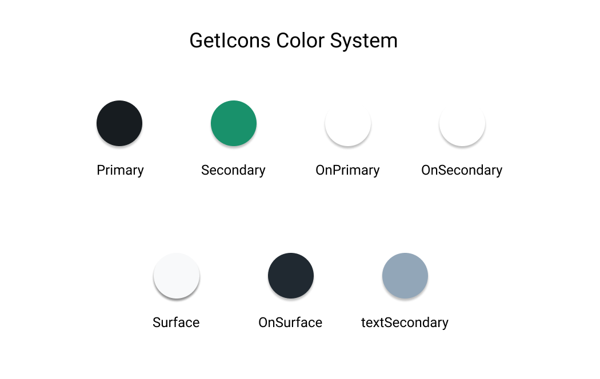
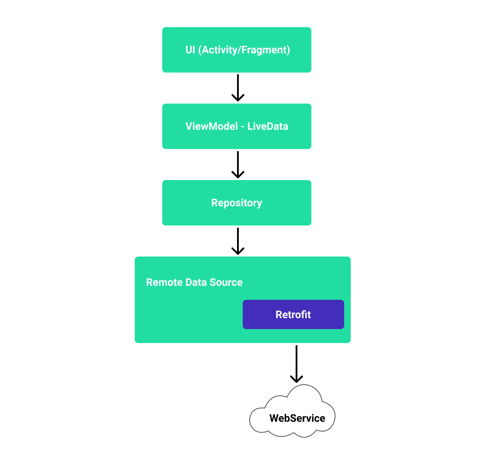
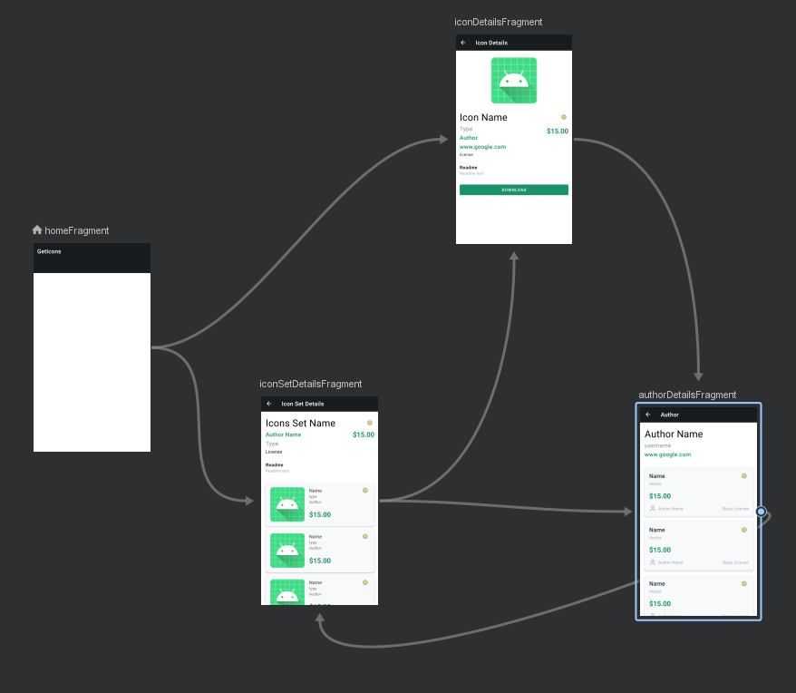
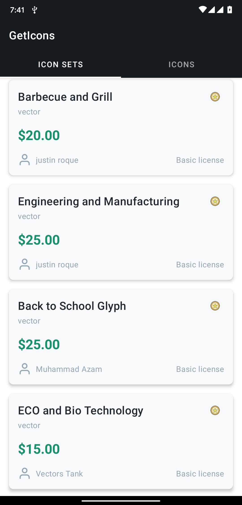
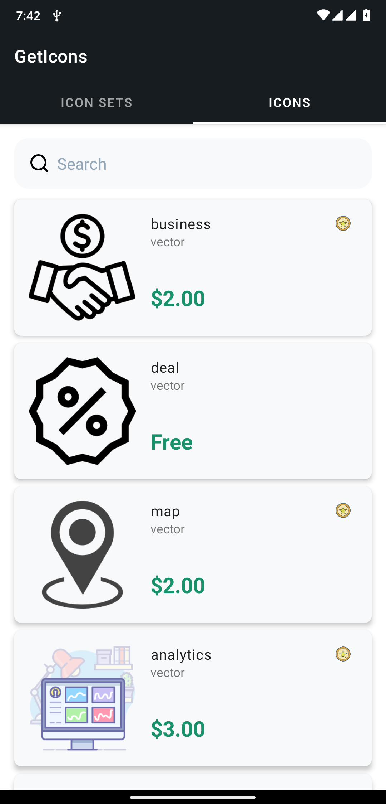
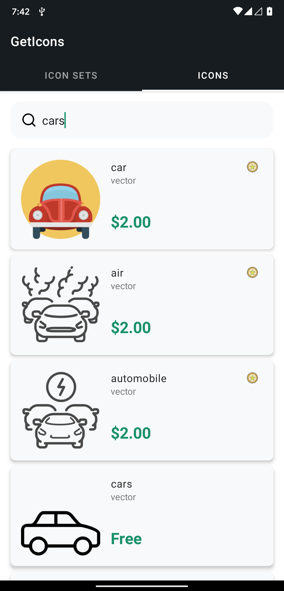
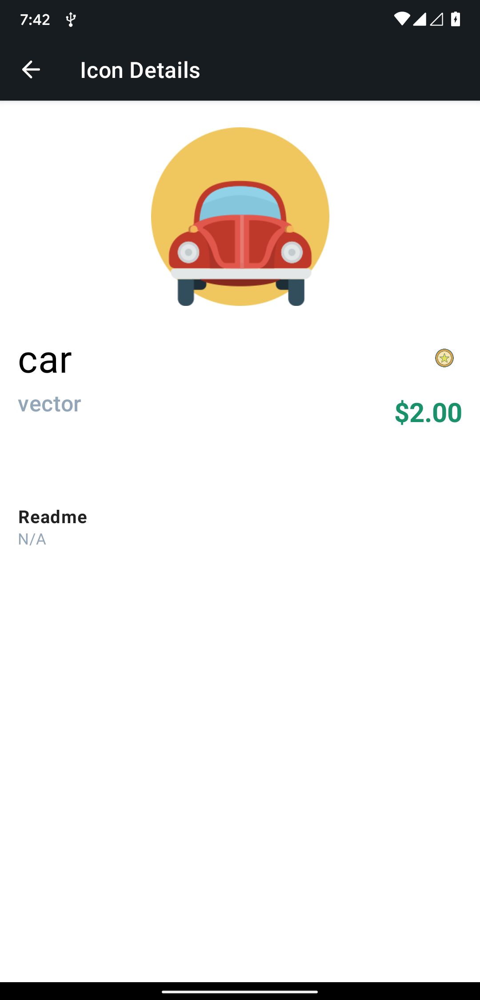
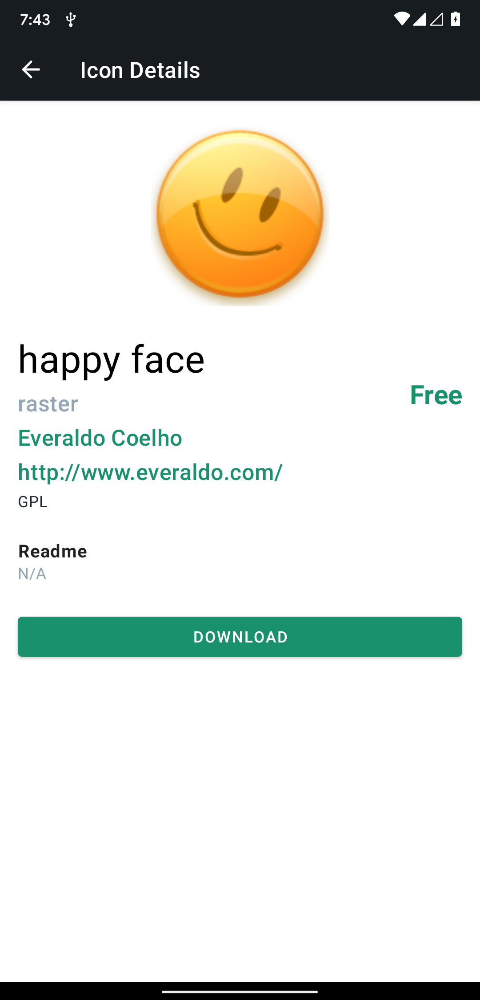
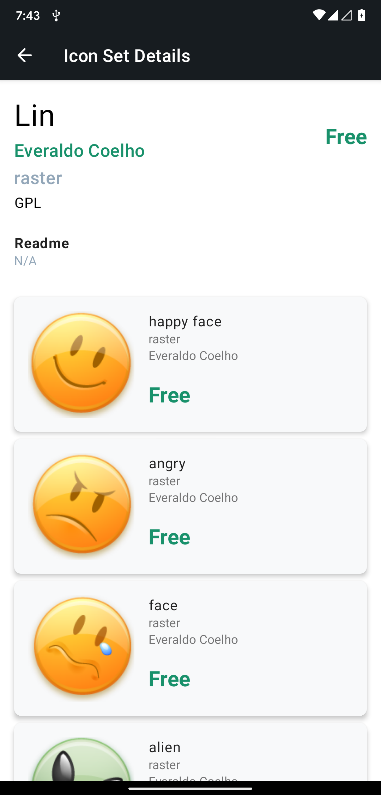
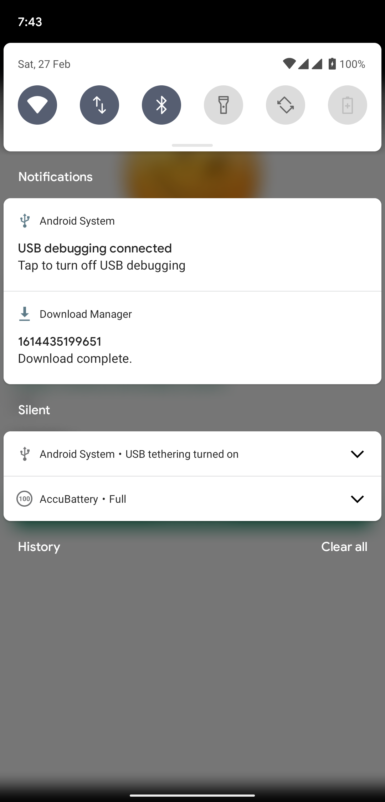

# GetIcons 👌


GetIcons is an unofficial IconFinder app that contains different icons from different publishers
around the globe.

## Features 🌟

1. Browse through 100s of Icon sets and Icons
2. Search for a particular icon
3. Icon Set Details
4. Icon Details
5. Author Details
6. Download free icons to mobile

## Color System 🎨



GetIcons follow Google's material design for the UI. All the colors selected are based on the IconFinder Website.


This badge denotes that the icon or the icon set is a premium icon. If an icon is a premium icon, then you cannot download the icon directly from the app.

## Architecture 🗼

This app uses [MVVM (Model View View-Model)](https://developer.android.com/jetpack/guide#recommended-app-arch) architecture.



## Folder Sturucture 📦

```
com.gigaworks.tech.geticons     # Root Package
├── di                          # Hilt DI Modules
├── domain                      # Data Models for the project
├── network                     # Retrofit
|   |── model                   # Retrofit Data transfer Object Models
|   |── response                # Response Object
|   └── service                 # Retrofit Service
|── repository                  # Repository to handle data operations
|── ui                          # Activity/Fragment View layer
└── util                        # All extension functions and utilities
```

## Built With 🛠

- [Kotlin](https://kotlinlang.org/) - First class and official programming language for Android development.
- [Coroutines](https://kotlinlang.org/docs/reference/coroutines-overview.html) - For asynchronous and more..
- [Android Architecture Components](https://developer.android.com/topic/libraries/architecture) - Collection of libraries that help you design robust, testable, and maintainable apps.
  - [Jetpack Navigation](https://developer.android.com/guide/navigation) - Navigation refers to the interactions that allow users to navigate across, into, and back out from the different pieces of content within your app
  - [ViewModel](https://developer.android.com/topic/libraries/architecture/viewmodel) - Stores UI-related data that isn't destroyed on UI changes.
  - [Hilt](https://developer.android.com/training/dependency-injection/hilt-android) - Dependency injection library for Android.
  - [Paging 3](https://developer.android.com/topic/libraries/architecture/paging/v3-overview) - The Paging library helps to load and display pages of data from a larger dataset from local storage or over network.
- [Retrofit](https://square.github.io/retrofit/) - A type-safe HTTP client for Android.
- [OkHttp 3](https://github.com/square/okhttp) - A modern HTTP client.
- [Glide](https://github.com/bumptech/glide) - A fast and efficient open source media management and image loading framework for Android.
- [Material Components for Android](https://github.com/material-components/material-components-android) - Modular and customizable Material Design UI components for Android.
- [ViewPager 2](https://developer.android.com/jetpack/androidx/releases/viewpager2) - Display Views or Fragments in a swipeable format.

## Domain Objects 📦

```java
data class Icon()           # Contains Icon object
data class IconSet()        # Contains IconSet object
data class Author()         # Contains Author object
```

## Navigation Graph



## Backend

The Iconfinder API is an HTTP JSON API and allows you to programmatically access resources on the service, such as icons, icon sets, categories, styles, authors, etc. The API is accessible on the api.iconfinder.com domain and always used over HTTPS. It accepts form-encoded request bodies, returns JSON-encoded responses, and uses standard HTTP response codes, authorization, and verbs.

## Limitations

- Due to the time limitation, could not implement error handling, few optimizations, designs etc.
- API is not clean and so, for some sets of data, fw entries are missing
- Searching for Icons, gives the list of Icons. This Icon object doesnot contain author detail or id. Due to which searching for individual icons doesnot show author details.
- Pagination of few pages are not implemented due to time constraint.
- Author's Icon set doesnot give icon set for the latest data. So most of the author details page is empty.
- Many more maybe that I dont remember now...

## Screenshots

| IconSets                                                                  | Icons                                                                  |
| ------------------------------------------------------------------------- | ---------------------------------------------------------------------- |
|  |  |

| Search Icons                                                              | Icon Details                                                           |
| ------------------------------------------------------------------------- | ---------------------------------------------------------------------- |
|  |  |

| Icon Details                                                              | Icon Set Details                                                       |
| ------------------------------------------------------------------------- | ---------------------------------------------------------------------- |
|  |  |

| Icon Download                                                             |
| ------------------------------------------------------------------------- |
|  |

## Video

[Watch Demo Video Here](https://github.com/arch10/get-icons/blob/main/docs/assets/video/GetIcons.mp4?raw=true)

## Download APK
[](https://github.com/arch10/get-icons/releases/download/1.0/app-debug.apk)

## License 🔖
```
    Apache 2.0 License
    
    Copyright 2018-2021 Gigaworks Tech
    
    Licensed under the Apache License, Version 2.0 (the "License");
    you may not use this file except in compliance with the License.
    You may obtain a copy of the License at

    http://www.apache.org/licenses/LICENSE-2.0
    
    Unless required by applicable law or agreed to in writing, software
    distributed under the License is distributed on an "AS IS" BASIS,
    WITHOUT WARRANTIES OR CONDITIONS OF ANY KIND, either express or implied.
    See the License for the specific language governing permissions and
    limitations under the License.
```
